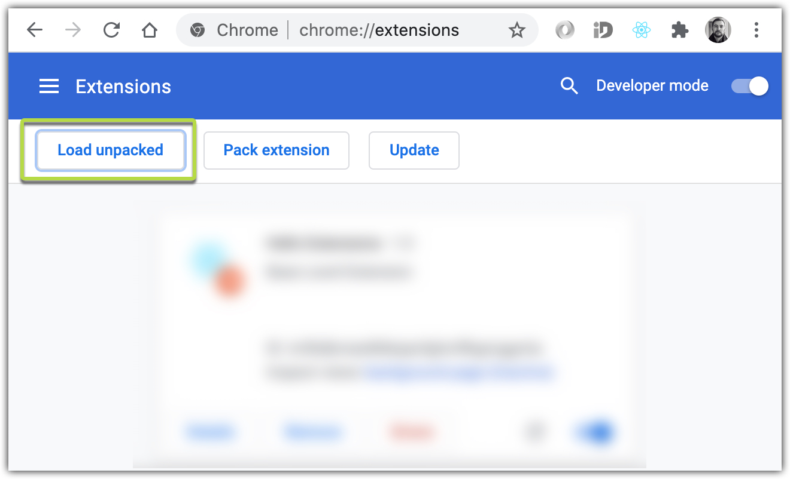

## 1. How it was created:

[Medium. How To Create A Google Chrome Extension With React](https://medium.com/javascript-in-plain-english/how-to-create-google-chrome-extension-using-react-js-5c9e343323ff)

## 2. How to build this extension:

```
$ yarn run build
```

## 3. How to add it to your Chrome browser:



Select `/build` folder


